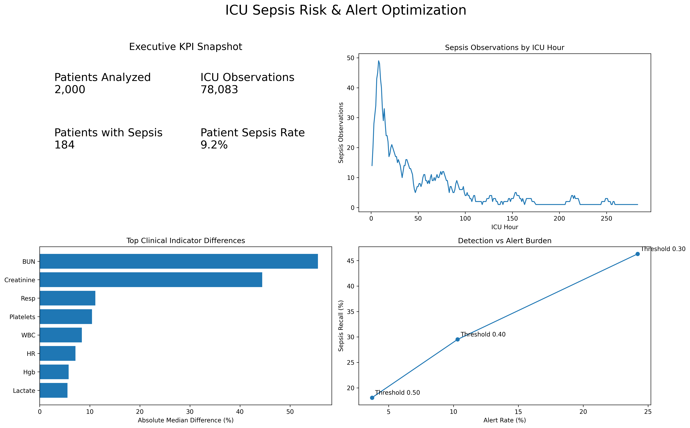

# ICU Sepsis Risk & Alert Optimization

### Healthcare Analytics | Risk Segmentation | Operational Strategy



---

## Business Problem

Sepsis is a time-sensitive condition where delayed identification can increase clinical risk, while excessive clinical alerts can create alert fatigue and operational burden.

This project analyzes ICU patient data to answer:

> **How can ICU teams prioritize higher-risk observations while balancing potential sepsis detection against alert burden?**

Rather than focusing only on predictive accuracy, the project approaches sepsis monitoring as a **data-driven decision-making and operational analytics problem**.

---

## Dataset & Scope

The analysis uses the **PhysioNet Computing in Cardiology Challenge 2019** ICU dataset.

### Working Dataset

- **2,000 ICU patients**
- **78,083 ICU-hour observations**
- 41 original clinical variables
- Vital signs, laboratory measurements and patient characteristics
- Hourly sepsis labels

---

## Analytical Approach

### 1. Exploratory Data Analysis

Analyzed:

- Patient-level sepsis prevalence
- ICU observation distribution
- Missing-data patterns
- Sepsis occurrence across ICU hours
- Differences in clinical indicators between sepsis and non-sepsis observations

### 2. Feature Engineering

Created temporal features to capture changes in patient condition, including:

- Rolling averages
- Short-term changes in clinical measurements
- ICU stay progression

### 3. Risk Modeling

Developed:

- Logistic Regression baseline
- Random Forest model

Model evaluation focused on:

- Precision
- Recall
- F1-score
- ROC-AUC
- PR-AUC

Because sepsis observations are relatively rare, accuracy was not treated as the primary decision metric.

### 4. Risk Segmentation

Model-generated risk scores were used to segment observations into:

- **Low Risk**
- **Moderate Risk**
- **High Risk**

The segments were evaluated against observed sepsis rates to assess whether risk scores meaningfully differentiated observations.

### 5. Alert Trade-off Analysis

Different alert thresholds were evaluated to quantify the relationship between detection and alert burden.

| Threshold | Recall | Precision | Alert Rate |
|---:|---:|---:|---:|
| 0.30 | 46.3% | 5.0% | 24.2% |
| 0.40 | 29.5% | 7.5% | 10.3% |
| 0.50 | 18.1% | 12.7% | 3.7% |

The results demonstrate a clear operational trade-off: increasing detection can substantially increase alert volume.

---

## Key Insights

### 1. Alerting is an operational trade-off

Lowering the alert threshold increases potential case detection but also increases the number of observations generating alerts.

### 2. Accuracy alone can be misleading

The relatively low prevalence of sepsis means overall accuracy does not adequately represent the usefulness of an alerting strategy.

### 3. Risk-based prioritization can support resource allocation

Segmenting observations by estimated risk provides a framework for prioritizing higher-risk observations rather than treating every ICU observation identically.

### 4. Temporal information provides additional context

Changes in patient measurements over time can provide useful information beyond individual measurements.

---

## Business Recommendations

### 1. Evaluate risk-based alerting

Prioritize higher-risk observations rather than applying identical alerting intensity across all ICU observations.

### 2. Balance detection with operational capacity

Alert thresholds should be evaluated using both potential case detection and the resulting alert workload.

### 3. Use a pilot-and-monitor approach

Before operational deployment, evaluate a candidate alerting strategy through controlled testing and monitor:

- Alert volume
- Precision
- Missed cases
- Response time
- Clinician workload
- Clinical outcomes

### 4. Establish an alert-performance dashboard

Monitor alert performance continuously to identify excessive alert volume, declining signal quality, or changes in patient populations.

---

## Executive Dashboard

The dashboard summarizes:

- Patient population
- Sepsis prevalence
- Sepsis timing across ICU stay
- Clinical indicator differences
- Risk segmentation
- Detection vs. alert-burden scenarios

---

## Tools

- Python
- Pandas
- NumPy
- Scikit-learn
- Matplotlib
- Google Colab

---

## Repository Structure

```text
icu-sepsis-alert-optimization/
│
├── README.md
├── requirements.txt
│
├── sepsis_analysis.ipynb
│
└── ICU_Sepsis_Executive_Dashboard.png
